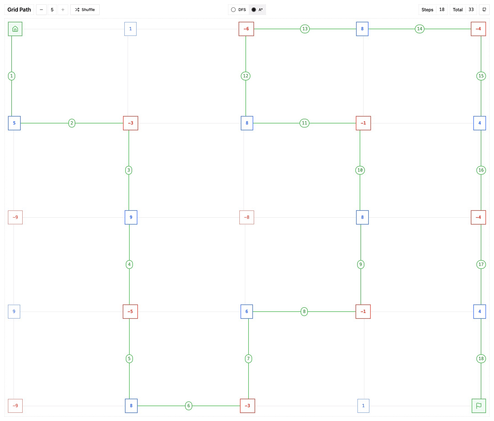

# Grid Path

### Max-Value Path Problem

- Start at top left. `(0, 0)`
- Finish at bottom right. `(n-1, n-1)`
- Each coordinate has a value: `positive`, `negative`, or `zero`.
- Do not revisit a coordinate.
- Do not move diagonally.

|                                Demo → https://gridpath.pages.dev                                 |
| :----------------------------------------------------------------------------------------------: |
| [](https://gridpath.pages.dev/?size=5&seed=231) |

## Requirements

- Node Package Manager[^1]

## Install Dependencies

```bash
npm install
```

## Build Application

```bash
npm run build
```

## Open in Browser

```bash
npm run preview -- --open
```

[^1]: https://docs.npmjs.com/downloading-and-installing-node-js-and-npm
